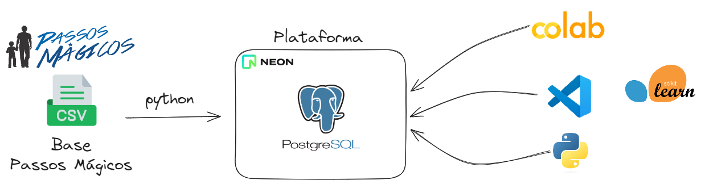

# 📊 DATATHON-2DTAT - GRUPO 26

Este repositório contém o projeto desenvolvido para o DATATHON da turma 2DTAT 2024.

## 📝 Visão Geral

O projeto visa criar uma análise de dados, previsão que ajude a Org Passos Mágicos. Ele foi desenvolvido em Python e utiliza várias bibliotecas de ciência de dados para processar e analisar os dados fornecidos.

## 🏛️ Arquitetura



A arquitetura do projeto é composta por arquivos CSV fornecidos pela instituição, um banco de dados PostgreSQL hospedado na plataforma Neon e uma aplicação Streamlit para exibir todas as análises e modelos. O fluxo de dados envolve a ingestão dos arquivos CSV no PostgreSQL, modelagem utilizando SQL, análise exploratória, desenvolvimento do modelo e construção do data app.

## 🛠️ Instalação

Para executar este projeto localmente, siga os passos abaixo:

1. Clone o repositório:
   ```bash
   git clone https://github.com/icarocarmona/DATATHON-2DTAT.git
   cd DATATHON-2DTAT
   ```

2. Crie um ambiente virtual (opcional, mas recomendado):
   ```bash
   python -m venv venv
   source venv/bin/activate  # No Windows, use venv\Scripts\activate
   ```

3. Instale as dependências:
   ```bash
   pip install -r requirements.txt
   ```

## 🚀 Como Executar Localmente

Para executar o projeto localmente, siga os passos:

1. Execute o aplicativo Streamlit:
   ```bash
   streamlit run Home.py
   ```

2. Acesse a aplicação no navegador através do endereço:
   ```
   http://localhost:8501
   ```

3. Insira os dados no formulário para realizar previsões e análises.

## 📂 Estrutura do Repositório

- **📁 notebooks/**: Contém notebooks Jupyter utilizados para análise exploratória de dados e desenvolvimento inicial do modelo.
- **📁 sql/**: Scripts SQL utilizados para manipulação dos dados.
- **📝 Home.py**: Arquivo principal para execução do aplicativo Streamlit.
- **📄 requirements.txt**: Lista de dependências necessárias para rodar o projeto.

## 🤝 Contribuições

Para contribuir com o projeto, faça um fork do repositório, crie uma branch para sua feature, e depois submeta um pull request.